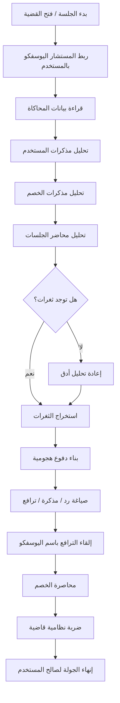

# منصة اليوسفكو للذكاء القانوني (Alyusufco Legal AI)
### الإصدار 2.0 - نظام المحاكاة والاستشارات القانونية الذكي

## 1. نظرة عامة
هذا النظام هو تطبيق ويب متقدم (Single Page Application) مبني باستخدام **React 19** و **TypeScript**، يعتمد بشكل كامل على الذكاء الاصطناعي التوليدي (**Google Gemini 2.5 Flash**) لتقديم خدمات قانونية متكاملة تحاكي الواقع القضائي السعودي.

## 2. الهيكل التقني (Tech Stack)
*   **الواجهة الأمامية:** React, Tailwind CSS, Lucide Icons.
*   **الذكاء الاصطناعي:** @google/genai SDK (Gemini 2.5 Flash Model).
*   **إدارة الحالة:** React useReducer (للمحرك المعقد في المحاكاة) و useState (للأقسام البسيطة).
*   **الرسوم البيانية:** Recharts.
*   **التخزين:** LocalStorage (للمفاتيح والبيانات المؤقتة).

---

## 3. شرح الأقسام الرئيسية (Core Modules)

### أ. صانع المذكرات الذكي (Memo Builder)
**المسار:** `components/MemoBuilder.tsx`
**الهدف:** إنشاء مذكرات قانونية رصينة بناءً على الوقائع والأدلة.

**آلية العمل (Workflow):**
1.  **مرحلة الإدخال (Intake):** يطلب من المستخدم إما رفع ملف القضية أو كتابة الوقائع.
2.  **تحليل المتطلبات (Evidence Check):** يقوم الـ AI بتحليل الوقائع واستخراج "قائمة المستندات الإلزامية" (مثل: السجل التجاري، تقرير الخبرة) ويطلب من المستخدم تأكيد توفرها.
    *   *دالة الخدمة:* `analyzeEvidenceRequirements` في `geminiService.ts`.
3.  **استكمال البيانات (Details):** إدخال أسماء الأطراف، المحكمة، والطلبات الختامية.
4.  **الصياغة (Generation):** يقوم الـ AI بكتابة المذكرة الكاملة بلغة قانونية رصينة، مع الإشارة للمستندات التي أكد المستخدم توفرها.

### ب. المحاكاة القضائية (Court Simulation)
**المسار:** `components/simulation/*`
**المحرك:** `components/simulation/state/machine.ts`
**الهدف:** تدريب المستخدم على جلسات المحاكمة عبر تقمص أدوار مختلفة.

**المكونات:**
*   **CaseDataPage:** نموذج ذكي لتعبئة بيانات القضية، يدعم التحليل الآلي للملفات (`extractCaseProfile`).
*   **SimulationEngine:** آلة حالات (State Machine) تدير مراحل الجلسة (الافتتاح، الدعوى، الأسئلة، الحكم) وتمنع تكرار الأدوار أو تجاوز المراحل المنطقية.
*   **AI Roles:** النظام يلعب دور القاضي، محامي الخصم (الحكومي أو الخاص)، والشهود.

### ج. تحليل الأحكام (Judgment Analyzer)
**المسار:** `components/Analyzer.tsx`
**الهدف:** استخراج فرص الاستئناف ونقاط الضعف في الصكوك.
**آلية العمل:** يدمج النص الذي يكتبه المستخدم مع محتوى ملف PDF المرفق، ويرسله للـ AI لاستخراج الثغرات الشكلية والموضوعية.

### د. المستشار الذكي (Legal Advisor)
**المسار:** `components/Advisor.tsx`
**الهدف:** الرد على الاستفسارات السريعة.
**آلية العمل:** واجهة دردشة بسيطة تتصل بـ `geminiService.getLegalAdvice` لتقديم إجابات مبنية على الأنظمة السعودية.

### هـ. إدارة القضايا (Case Manager)
**المسار:** `components/CaseManager.tsx`
**الهدف:** حفظ واسترجاع جلسات المحاكاة.
**البيانات:** يتم حفظ كامل حالة المحاكاة (`SimulationState`) بما في ذلك سجل الرسائل والمرحلة الحالية في `LocalStorage`.

---

## 4. خدمات الذكاء الاصطناعي (Gemini Service)
**المسار:** `services/geminiService.ts`
يحتوي هذا الملف على كافة "الدعوات" (Prompts) الموجهة للذكاء الاصطناعي.

**أهم الدوال:**
*   `analyzeEvidenceRequirements`: تستقبل وقائع -> تخرج قائمة JSON بالمستندات المطلوبة.
*   `generateLegalMemo`: تستقبل هيكل القضية + المستندات المؤكدة -> تخرج نص المذكرة.
*   `extractCaseProfile`: تستقبل ملف -> تخرج بيانات القضية (JSON) لتعبئة الحقول تلقائياً.
*   `simulateSessionTurn`: العقل المدبر لردود القاضي والخصوم في المحاكاة.

---

## 5. حالة الطوارئ (استعادة النظام)
في حال فقدان الكود أو حدوث خلل، يجب التأكد من وجود الملفات التالية ليعمل النظام:
1.  `types.ts`: التعريفات الأساسية.
2.  `services/geminiService.ts`: جسر التواصل مع الـ AI.
3.  `components/simulation/state/machine.ts`: منطق المحاكاة.
4.  `components/MemoBuilder.tsx`: كود صانع المذكرات الجديد.

**حقوق التطوير محفوظة لمكتب اليوسفكو.**

---

## ملحق: دورة الترافع مع المستشار اليوسفكو

